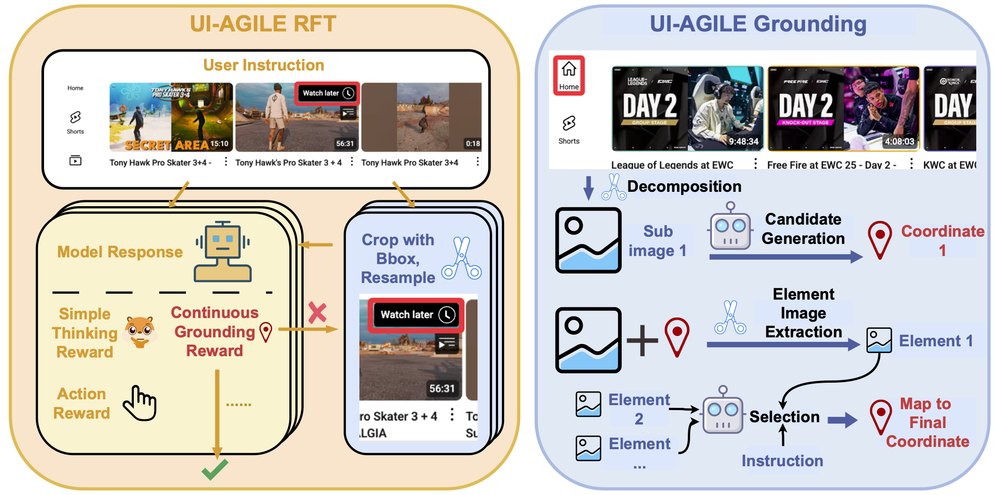
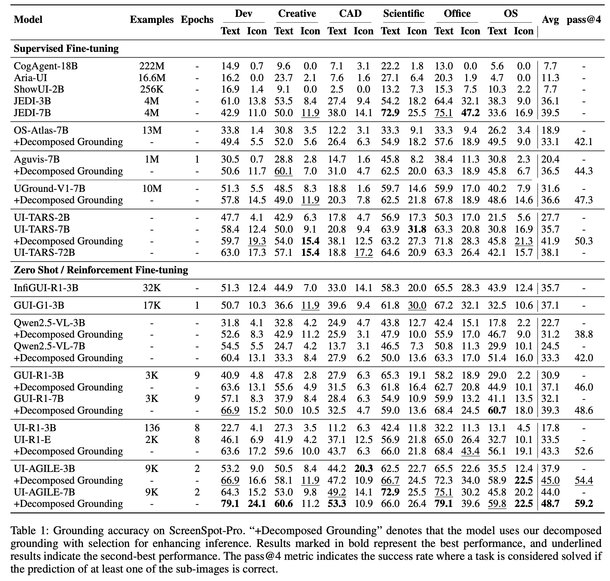
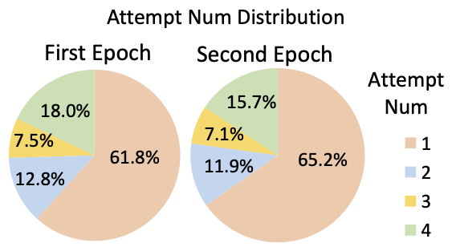

# UI-AGILE: Advancing GUI Agents with Effective Reinforcement Learning and Precise Inference-Time Grounding

<font size=4><div align='center' > [[📖 Paper](https://arxiv.org/abs/2507.22025)] [[🤗 Checkpoints](https://huggingface.co/KDEGroup/UI-AGILE)] [[🤗 Data](https://huggingface.co/datasets/KDEGroup/UI-AGILE-Data)] [[🤗 Daily Paper](https://huggingface.co/papers/2507.22025)] [[🚀 Github](https://github.com/KDEGroup/UI-AGILE)]</div></font>

## 🔥 Overview

UI-AGILE enhances GUI agents through improved training with a Continuous Reward function, Simple Thinking reward, and **Cropping-based Resampling**, and inference with **Decomposed Grounding with Selection**.
  



Trained on about only **9k** samples for just **2 epochs**, UI-AGILE shows superior performance, while also showcasing strong general agent capabilities. Furthermore, our inference method can act as a **plug-and-play enhancement** for a wide range of existing agents, improving the accuracy of some existing open-source models.


As a baseline, the standard grounding approach applied to UI-AGILE-7B completes the benchmark in **30 minutes**. When applying our method, the decomposed grounding stage takes **35 minutes**. The subsequent VLM-based selection stage requires additional **4 minutes**. The modest increase in overhead is a practical trade-off for the substantial gain of grounding accuracy brought by our method.





"Attempt Num Distribution" shows the distribution of attempts per GRPO training step, where each step processes a batch of two training samples. In the first epoch, we find that **only 61.8%** of training steps are fully successful on the initial attempt (i.e., both samples in the batch are solved without resampling). This means that without our strategy, a minimum of **19.1%** (38.2% ÷ 2) of training samples **would have provided no learning signal**. Overall attempt numbers decreases in the second epoch, demonstrating that the model learns from the samples salvaged by our method.





## Setup

We provide the code for our RFT training and the Decomposed Grounding with Selection method in two separate modules. To avoid potential dependency conflicts, each module is designed to be run in its own conda environment.


## Inference

```shell
cd eval
```

To accelerate evaluation, we organize data as parquet and provide evaluation code.

You can easily adapt your models to our pipline.

eval/grounding/eval_grounding_vllm_no_ray.py is for grounding benchmarks (Screenspot-v2 and Screenspot-Pro).

eval/android_control/inference_android_control_refactored.py is for AndroidControl.


## Training

```shell
cd train/src/scripts
bash train.sh
```


## ⭐️ Citation

If you find this project useful, welcome to cite us.

```bit
@misc{lian2025uiagileadvancingguiagents,
      title={UI-AGILE: Advancing GUI Agents with Effective Reinforcement Learning and Precise Inference-Time Grounding}, 
      author={Shuquan Lian and Yuhang Wu and Jia Ma and Zihan Song and Bingqi Chen and Xiawu Zheng and Hui Li},
      year={2025},
      eprint={2507.22025},
      archivePrefix={arXiv},
      primaryClass={cs.AI},
      url={https://arxiv.org/abs/2507.22025}, 
}
```


## 🤝 Acknowledgements

We sincerely thank projects [R1-V](https://github.com/Deep-Agent/R1-V), [Open-R1](https://github.com/huggingface/open-r1), and [Open-r1-multimodal](https://github.com/EvolvingLMMs-Lab/open-r1-multimodal), [VLM-R1](https://github.com/om-ai-lab/VLM-R1) for providing their open-source resources.
